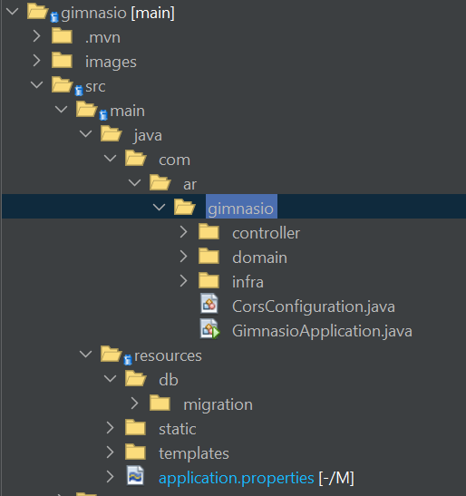
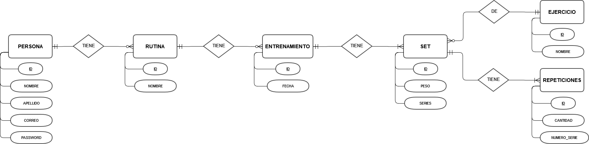
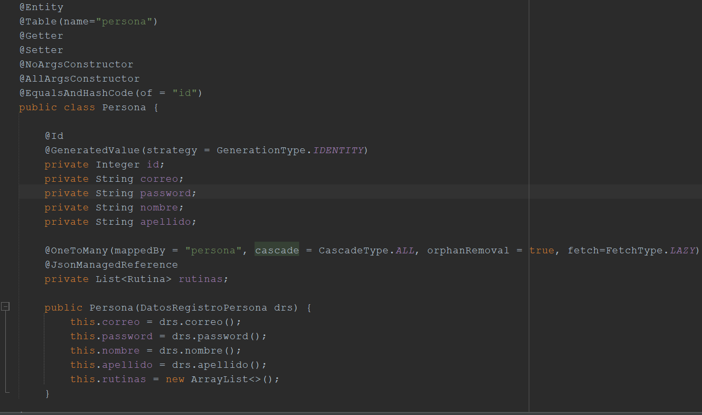
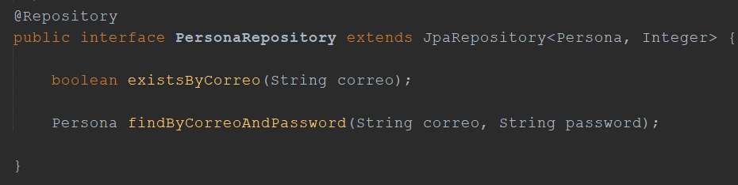
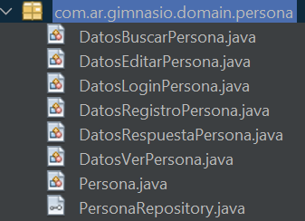
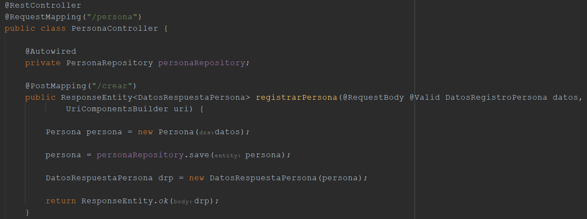

# Backend Spring del Proyecto "Gimnasio con Spring-Angular"

Este es el repositorio del backend Spring que hace de API para el proyecto [Gimnasio Angular-Spring](https://github.com/Cosas-de-Martin/Gimnasio-Angular-Spring/wiki)

## Contenido

1. [Requisitos Previos](#requisitos-previos)
2. [Configuración del Proyecto](#configuración-del-proyecto)
3. [Ejecución del Proyecto](#ejecución-del-proyecto)
4. [Estructura del Proyecto](#estructura-del-proyecto)
5. [Base de Datos](#base-de-datos)
6. [Funcionamiento del Proyecto](#funcionamiento)

## Requisitos Previos

Asegúrate de tener instalados los siguientes elementos antes de comenzar:

- Java Development Kit (JDK): [Descargar e Instalar JDK](https://www.oracle.com/java/technologies/javase-downloads.html)
- Spring Boot: Puedes incluirlo como dependencia en tu proyecto o instalarlo manualmente.

Las versiones utilizadas en este proyecto fueron:
  - Spring Framework 3.1.5
  - Flyway 9.16.3
  - Lombok 1.18.30
  - JDK 17
  - MySQL 8.0

## Ejecución del Proyecto

Ejecuta el proyecto localmente utilizando tu IDE o el siguiente comando:

```
./mvnw spring-boot:run
```

Asegurarse de tener una base de datos llamado `gimnasio` en MySQL u otro sistema gestor de base de datos. Ante la duda, revisar el archivo `src/main/resources/application-properties.xml` para configurar la conexión.

Se puede acceder a la funciones del mismo vía el Frontend o utilizar algún software como Postman para hacer las Requests.

## Estructura del Proyecto

Posicionándonos sobre la carpeta `src/main/java/com/ar/gimnasio` encontraremos la mayoría de los archivos del proyecto: la clase principal `GimnasioApplication.java` y la configuración del CORS `CorsConfiguration.java`, una carpeta `infra` con la configuración de Spring Security `security/SecurityConfiguration.java` y las más extensas, las carpetas `controller` y `domain`. Como se puede sospechar, la primera tiene los distintos controladores que ejecutan los métodos de consulta a la Base de Datos según el path ingresado en la URL y el tipo de petición HTTP. La segunda posee las clases que mappean las entidades de la base de datos, los Repository de cada una de ellas y los Record utilizados para devolver la información que queramos según el método utilizado en los controller.

Por otro lado, en `src/main/resources`, tenemos el archivo de configuración de acceso a la bases de datos `application.properties` y las migraciones hechas con Flyway en `db/migration` con distintas consultas DDL para la creación de las entidades en la misma.



## Base de datos

Localmente se utilizó MariaDB 10.4.28 con XAMPP 3.3.0 y en la nube con MySQL 8.0. Debería resultar indistinta la elección para correr la aplicación.

Se muestran a continuación el DER utilizado para este proyecto y su mappeo al modelo relacional.

DER



Modelo Relacional


## Funcionamiento del Proyecto

Cada una de las entidades están representadas en su correspondiente package `.domain` con una clase con notación `@Entity`, su nombre en la base de datos y anotaciones útiles de Lombok para reducir la cantidad de código y facilitar la legibilidad del mismo. Las relaciones entre las tablas se trataron con anotaciones `@OneToMany` y `@ManyToOne`, dado que todas eran de tipo 1 a N. 

Del lado del `@OneToMany` se creó un atributo con la lista de Entidades con las que ese _One_ está relacionado y se utilizó la notación `@JsonManagedReference`. Del lado `@ManyToOne` se tiene un atributo con la clase que mappea a la Entidad con la que se relaciona el N y se le agregó la notación `@JsonBackReference`. Con ambas notaciones de Reference se previene que Spring entre en un bucle al intentar serializar una clase al formato JSON.



Aparejadamente, cada entidad tiene una interface `Repository` de Spring Data asociada que permite, con sus métodos y algunos propios declarados, hacer las consultas DML a la base de datos.



Para manejar los datos que se esperan recibir en el Body de una Request, o que se espera devolver a partir de una, cada `.domain` tiene una serie de Java Records de nombre `DatosFuncion` (para la función que sea que cumplan) que actúan como DTOs para elegir que información mostrar o recibir de las entidades.



Por cada entidad en base de datos se tiene un Controller en la carpeta de mismo nombre con el path `/entidad` (para el nombre de la entidad) seguido de un nombre representativo de la función que se quiera utilizar y un tipo de Request asociado (ejemplo: `/persona/crear`).



Próximamente documentaré en detalle los distintos métodos de los que dispone, sus valores esperados y de salida utilizando Swagger.


